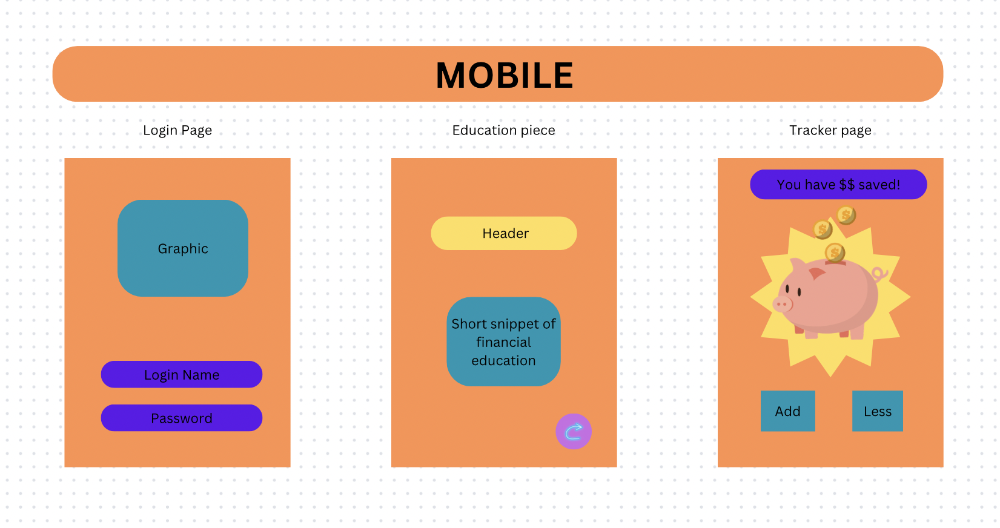
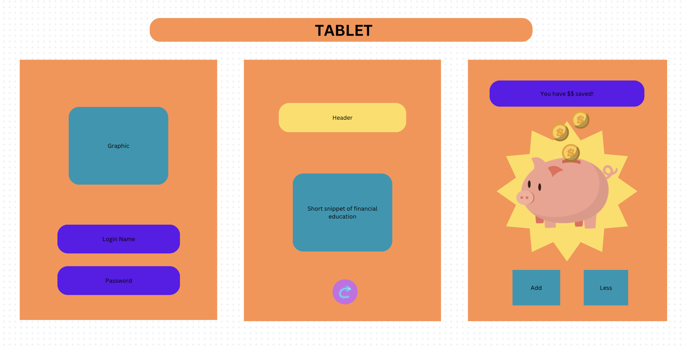
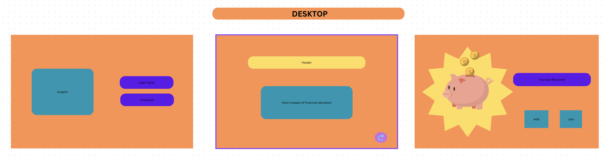

# Project Title

## Overview

My app has two simple goals: one, to allow for children and teens to be able to track their savings, and two, to promote financial literacy amongst them. 

My MVP consists of 4 pages (2 will be for later sprints as nice to haves, and 2 will be part of the core deliverables) - a sign up page, a login page, and once logged in, the first page it will direct the user to will present a little nugget of financial information to promote understanding of basic financial concepts, and then the user can proceed to updating their savings balance, as well as checking their savings. 

### Problem

Financial literacy is an important tool to have, and healthy financial habits can help all individuals throughout their lives. 
For children, this information is rarely taught, and if a weekly/monthly allowance is given, perhaps if it is combined with a better understanding of how money works, they can become more responsible with the money they have. 

### User Profile

This app will be geared towards teenagers and children who may be old enough to get pocket money, so that they can track their funds. 

### Features

Core requirements: 
Education page: Will display a short snippet of financial information. A button to then link to the next page. It is an intentional decision to have the education piece be the landing page after login, so that it primes the user to think from an informed place, before looking at their money tracker. 
Tracker: User input will be required here to increase or decrease the money saved/spent. The balance available will be updated.

Nice to haves:
Sign up page: Allows user to create username, and password, and provide a name along with it to assign to the account. Button to allow information to be sent to the database. 
Login Page: will take in username and password to allow access to account details, so that past balance is rendered. 

## Implementation

### Tech Stack

Tech stack: MySQL, React, Express, Node, JavaScript, HTML, SASS. 
Libraries: Axios, Toastify, Reacter-router, among others. 

### APIs

Core requirements:
Will use an API to house all the educational snippets. 

Nice to have:
A database will need to be created to store account balances. 

### Sitemap

Please refer to project mockups.

### Mockups

### Data

Core requirements:
Education page - Will retrieve a randomized item from the API to display to user. 
Tracker - Will allow for user to update their balance, by adding or subtracting an amount. Once updated, this will update their account balance.

Nice to haves:
Sign up page - will send data to store in database
Login in page - will find matches with existing user accounts, and if matches are found, will allow for user to login 

### Endpoints

Core requirements:
api.get(“/home”) - Display’s user’s own account - displays educational information
api.get(“/tracker”) - retrieves stored data - which is previous account balance
api.post(“/tracker”) - sends updated balance after user either adds, or subtracts from existing balance

Nice to haves:
api.post(“/signup”) - Allows for new user to create an account
api.post(“/login”) - Allows an existing user to send login information, to then be able to retrieve their account

### Auth

This app might have login information, but that is not part of the core requirements. If login information is added, it will not not require any personal information, other than login credentials to remember the data, considering that the website is geared towards a younger audience, there is less personal data that will be taken from them. The login is just so that their personal account remembers their balance. 

I hope to build on this project, so eventually, login information will be required, even if it not added as part of the capstone project itself. 

## Roadmap

Sprint 1 - Work on education + tracker pages to ensure API calls work. 
Sprint 2 - Add login authentication/authorization to then allow for user accounts 
Sprint 3 - Add any additional nice-to-haves that there will be time and capacity for

## Nice-to-haves

// Login authentication/authorization
// Savings goals (amount and by what date)
// Feedback for how long it took for user to meet their goal